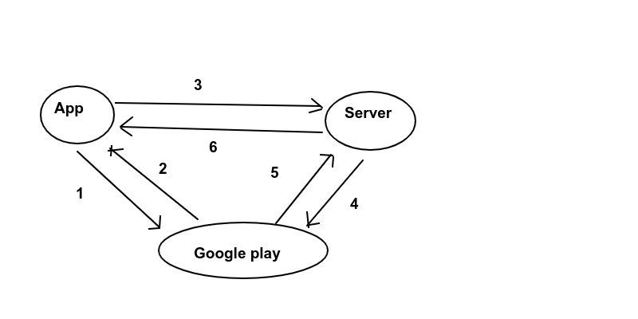

# Training_In-app_billing

## I. Tổng quan

### 1. Khái niệm chung

 Một số hình thức kiếm tiền từ app:

- Paid: trả tiền trước rồi mới được sở hữu ứng dụng

- Free-to-use: down về miễn phí, người dùng có thể sử dụng được hết các tính năng trong app. Nhưng giả sử  trong game muốn có đồ tốt hơn, skill mạnh, trang phục, ... sẽ phải mua 

- Freemium: down về miễn phí, nhưng muốn mua thêm các tính năng mới, tiện ích mới thì phải mua.

- Ad-funded: kiếm tiền qua quảng cáo

 Những cách hay dùng bây giờ là Free-to-use vs Freemium. Chúng sử dụng in-app billing, là tính năng được tích hợp bên trong ứng dụng để giúp người dùng có thể mua những bổ sung, những tiện ích thêm trong ứng dụng

 Trong Android, ta sử dụng Google Play Billing - dịch vụ giúp bán những nội dung số.

 Một số ví dụ như trong game ta có thể mua thêm lượt chơi, mua thêm vật phẩm, thêm màn chơi, thêm tiện ích, ... Trong app khác thì ta có thể mua thêm các gói chức năng, tiện ích, công cụ nâng cao. Sử dụng các app như Netflix, Spotify, ... phải trả phí sử dụng hàng tháng. 

### 2. Các loại sản phẩm

Có 3 loại

- One-time: mua 1 hoặc nhiều lần, không định kì. Ví dụ như màn chơi, bài hát, film, ...


- Rewarded: yêu cầu người dùng xem quảng cáo video. Sau khi xem người chơi sẽ có thêm mạng, hoàn thành nhanh, vật phẩm mới, ...


- Subscription: yêu cầu người dùng thanh toán định kì, theo tháng, theo quý, năm, ...


### 3. Purchase token và order Ids

Google Play Billing quản lý sản phẩm và phiên làm việc thông qua purchase token và order id:

- Purchase token: chuỗi token đại diện cho quyền lợi của người dùng tới 1 sản phẩm trên Google Play. Nó chỉ thị người dùng đã trả tiền cho 1 sản phẩm cụ thể, đại diện bởi 1 SKU 

- Order id: chuỗi đại diện cho 1 phiên giao dịch tài chính trên Google Play. Chuỗi này được bao gồm trong hóa đơn mà được gửi mail tới người mua. Còn được dùng trong báo cáo bán hàng và thu chi.

Vs sản phẩm one-time và rewarded, mỗi lần mua mới sẽ tạo ra 1 purchase token và order id mới

Vs sản phẩm subsription, mua lần đầu sẽ tạo mới purchase token và order id. Những lần sau thì purchase token giữ nguyên, order id sẽ được tạo mới. 

Nâng cấp, hạ cấp hay đăng kí lại sẽ đều tạo mới purchase token và order id.

### 4. Tùy chọn cho sản phẩm 

Có thể chỉnh nhiều thông số như:

- Tiêu đề

- Miêu tả 

- Product Id

- Giá cả 

Promo code: mã giảm giá giúp người dùng có sản phẩm one-time miễn phí. 

### 5. Tùy chọn sản phẩm subscription

Có thể chỉnh các thông số

- Thời hạn thanh toán

- Thời hạn thử miễn phí

- Giá giới thiệu 

...

### 6. Các bước thêm thanh toán vào trong ứng dụng

**Bước 1**: Thực hiện thêm code Google Billing vào app

- Thêm dependency

```
  dependencies {
      ...
      implementation 'com.android.billingclient:billing:2.0.0'
  }

```

- Kết nối tới Google Play

```
 mBillingClient = BillingClient.newBuilder(this).setListener(this).build()

 mBillingClient.startConnection(object : BillingClientStateListener {
            override fun onBillingSetupFinished(billingResult: BillingResult) {
                when {
                    billingResult.responseCode == BillingClient.BillingResponseCode.OK -> {
                        Toast.makeText(this@MainActivity, "Setup ok", Toast.LENGTH_SHORT).show()
                    }
                    else -> Toast.makeText(this@MainActivity, "Setup fail", Toast.LENGTH_SHORT).show()

                }
            }

            override fun onBillingServiceDisconnected() {
                Toast.makeText(this@MainActivity, "Setup Disconnected", Toast.LENGTH_SHORT).show()

            }

        })
```
- Query sku list, lấy thông tin các product id

Khai báo sku list

```
 var mListSku = listOf("object_1", "object_2", "object_3", "object_4")

```

Tạo sku param

```
 mSkuParam = SkuDetailsParams.newBuilder()
            // list to query
            .setSkusList(mListSku)
            .setType(BillingClient.SkuType.INAPP).build()
```

Gọi hàm để lấy thông tin

```
    fun onLoadProductClicked() {
        when (mBillingClient.isReady) {
            true -> {
                Toast.makeText(this@MainActivity, "mBillingClient.isReady is true", Toast.LENGTH_SHORT).show()
                mBillingClient.querySkuDetailsAsync(mSkuParam) { billingResult, skuDetailsList ->
                    run {
                        when (billingResult.responseCode == BillingClient.BillingResponseCode.OK) {
                            true -> {
                                initProductAdapter(skuDetailsList)
                            }
                            false -> Toast.makeText(this@MainActivity, "Query failed", Toast.LENGTH_SHORT).show()
                        }
                    }
                }

            }
            false -> Toast.makeText(this@MainActivity, "mBillingClient.isReady is false", Toast.LENGTH_SHORT).show()
        }
    }
```

- Mua product 

```
 val billingFlowParams = BillingFlowParams.newBuilder().setSkuDetails(it).build()
 mBillingClient.launchBillingFlow(this, billingFlowParams)
```

- Kết quả thanh toán sẽ trả về qua  PurchasesUpdatedListener, trong phương thức onPurchasesUpdated()

```
override fun onPurchasesUpdated(responseCode: Int, purchases: MutableList<Purchase>?) {
    when(responseCode) {
        BillingClient.BillingResponse.OK -> {
            purchases?.let {
                // Handle response success
            }
        }
        BillingClient.BillingResponse.USER_CANCELED -> {
            // Handle response cancel
        }
    }
}
```
Ngoài ra còn có thể hỗ trợ mua sản phẩm bên ngoài app, đính kèm developer payload, ...


**Bước 2**: Create file apk/ app bundle

Build apk, app bundle ở phiên bản release (Build -> Generate Signed Bundle/APK), trong đó chứa quyền Billing

**Bước 3**: Upload app lên Google Play Console

- Cần có một tài khoản Google Play Console, sau đó làm theo hướng dẫn để publish app. Nên để ở bản alpha, beta hoặc internal test.

**Bước 4**: Chuẩn bị sản phẩm

Tạo các sản phẩm managed product, subscription, rewarded product muốn đưa vào ứng dụng

**Bước 5**: Test Play Billing

Thêm tài khoản Google test (thêm mail) và test trên các thiết bị để tránh bị mất tiền.


### 7. Quy trình verify thanh toán

Thông thường flow của thanh toán có server như sau:



1. Gửi request mua hàng tới Google Play, qua hàm launchBillingFlow()

2. Google trả về thông tin purchase, trong đó có nhiều thông tin như token, time, order Id, ... thông qua hàm onPurchasesUpdated()

```
{
    "orderId":"1299976316905--.13643659--",
    "packageName":"my package name",
    "productId":"77",
    "purchaseTime":13662--,
    "purchaseState":0,
    "purchaseToken":"utfwimslnrr--.AO-J1OwZ4l5oXz_3d2SAWAAUgFE3QErK--IY2p2LnlV4tpH4NITB4mJMX98sC--Izw3tfW_GflJDKFyb-g"
}
```

3. Gửi purchase token và chứng chỉ tài khoản người dùng tới server

4. Server request lên Google Play, gửi theo package name, product ID và purchase token, để nhận về purchase detail

5. Server nhận về purchase detail, check order Id nhận được là duy nhất

6. Server sử dụng chứng chỉ tài khoản người dùng nhận được ở bước 1 để liên kết token vs người sử dụng

=> Người dùng giờ có thể sử dụng tính năng


Không có server thì có thể xem tại: https://developer.android.com/google/play/billing/billing_library_overview#Verify-purchase-device


